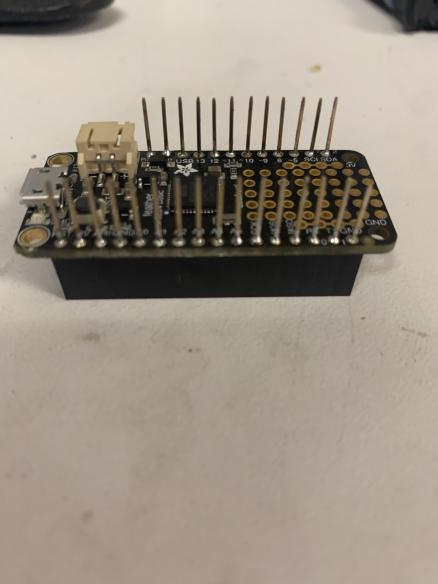
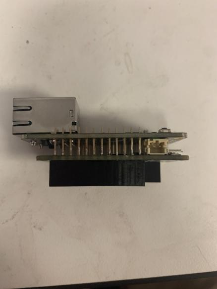
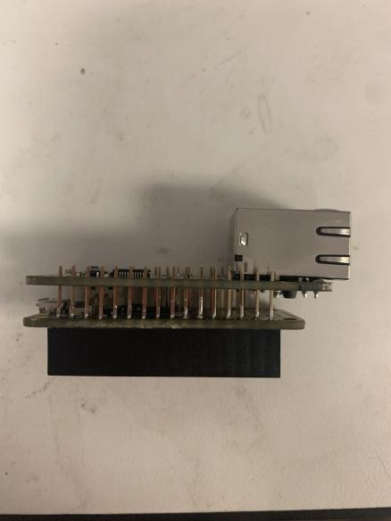
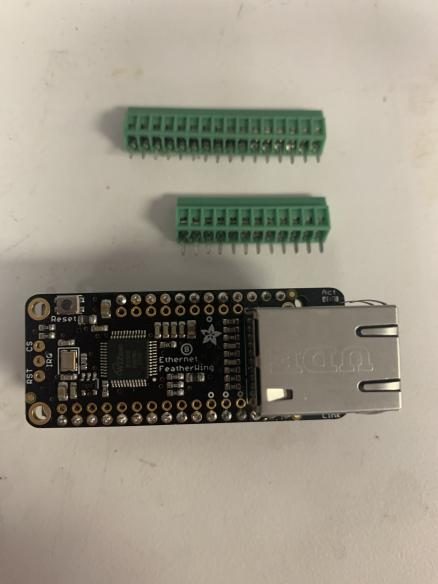
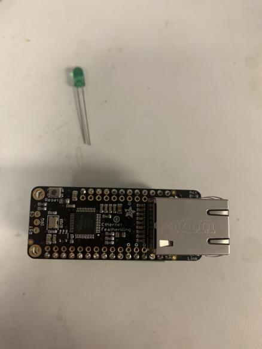
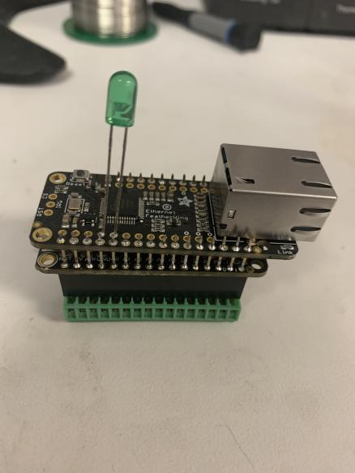
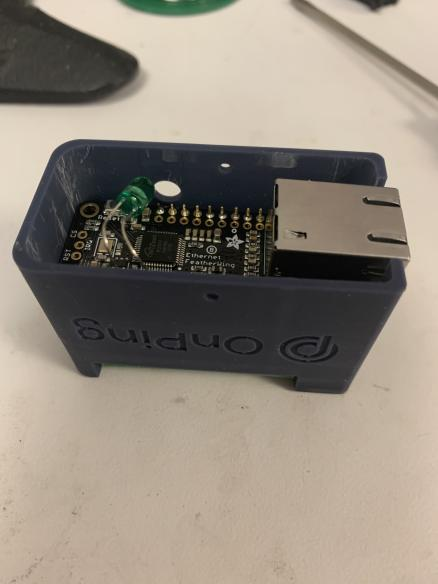
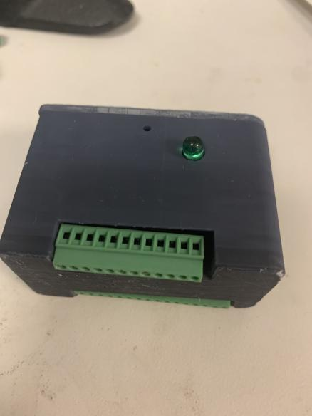

## Assembly guide ##

Insert the stacking pin headers into the feather and solder the connections to the board as shown:

Align the Ethernet Featherwing so that it is parallel with the Feather 32u4 and resting on the LiPoly port:

Solder the pin connections to the Ethernet Featherwing:

Insert the two screw terminals into the stacking pin headers.

Attach the long end (anode) of the LED to the A0 pin and the short end (cathode) to the GRD pin.

Insert the assembly into the 3d printed case and bend the LED such that it fits into the hole.

Attach the lid.

You have fully assembled the Pulse.
